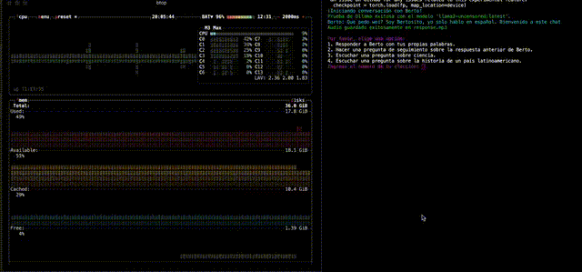

# 🚖 fully local taxi-driver language assistant

## 📝 overview

this project provides a fully local language assistant called berto. berto can listen to your audio, transcribe it using whisper, and then interact with you in spanish using an ai model served locally via ollama. it also has text-to-speech capabilities to provide audio responses. 🗣️

## 🌟 features

- local transcription of spoken language using whisper. 🎤
- interaction with an ai model (llama 2 uncensored) served locally via ollama. 🦙
- conversation options, including following up on questions related to science, history, and politics. ❓
- text-to-speech responses using edge tts. 🔊
- audio playback of berto's responses. 🎧

## 🎥 demo



[watch the demo video here](./demo.MOV)

## 🚀 setup

### 1. install dependencies 📦

first, you need to install the required packages. you can do this by running the following command to install all dependencies from the `requirements.txt` file:

```bash
pip install -r requirements.txt
```

### 2. download and install ollama 🛠️

this project requires ollama to serve the ai model (`llama2-uncensored`). you can download ollama from the [Ollama website](https://ollama.com/) and install it on your local machine.

once installed, you need to download the model:

```bash
ollama run llama2-uncensored
```

make sure ollama is running on `localhost:11434` to handle the requests.

### 3. run the script 🎬

to run the assistant, execute the following script:

```bash
python bertosito_chat.py
```

this will start a conversation with berto, who will transcribe your spoken audio and respond based on the conversation using the ai model hosted on ollama.

### 💡 how it works

- **recording audio:** berto listens to your voice and transcribes it using whisper. 🎤
- **generating responses:** it sends your transcribed text to the ai model and generates a response. 💬
- **text-to-speech:** berto will convert the generated response to speech and play it back. 🔊
- **conversation options:** the assistant presents multiple conversation options, including asking questions and following up on prior responses. 🤔

## 📂 file structure

- `bertosito_chat.py`: the main script to run berto. 🖥️
- `response.mp3` and `response.wav`: audio files generated during interaction. 🎶
- `requirements.txt`: file containing all the necessary dependencies. 📜
- `demo.mp4`: demo video showcasing the app. 🎥

### 📝 notes

- ensure that you have ollama running locally and the required models downloaded before starting the script. 🛠️
- the assistant only responds in spanish and expects interactions in the same language. 🇪🇸
- make sure to run ollama using the exact model name `llama2-uncensored`. 🦙

---

enjoy interacting with berto! 🎉
